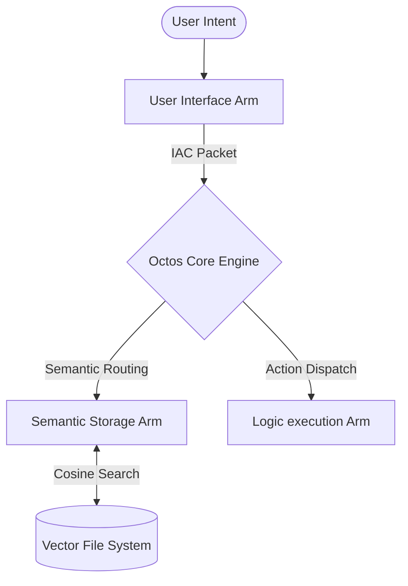

# The Octos Manifesto: AI-First Bare-Metal Operating System Framework

## 1. Vision: Beyond Files and Folders
Modern operating systems are relics of the late 20th century, built around hierarchical filesystems, static application bundles, and synchronous user-driven event loops. 

**Octos** is built from the ground up for a world where computing is driven by agentic intelligence. Primitives are not files, but *knowledge nodes*; execution is not scheduled processes, but *collaborative agentic loops*; communication is not simple IPC pipes, but *latent-space semantic protocols*.

## 2. Core Architectural Pillars

### A. Non-Hierarchical Vector File System
Instead of directories (`/usr/bin`, `/home/user/docs`), Octos organizes state as a unified, high-dimensional latent space. Every piece of state—whether it is code, unstructured documentation, user history, or active telemetry—is a **KnowledgeNode** placed in this vector space. Retrieval is governed by semantic distance (cosine similarity) rather than explicit paths.

### B. Inter-Arm Communication (IAC) Protocol
Instead of standard sockets or pipelines, subsystem components (referred to as **Arms**) communicate using **IacPackets**. An `IacPacket` carries:
1. **Goal ID**: Associating all sub-actions with an overarching user objective.
2. **Intent String**: High-level natural language or protocol intent.
3. **Latent Space Vector**: Semantic direction of the communication.
4. **Structured Payload**: Serialized state details.

### C. Agentic Arm Orchestration
The operating system core is an asynchronous scheduler that routes intent to different hardware/software capabilities (Arms). Arms register their specific operational strengths (e.g. `SemanticStorage`, `CodeExecution`, `WebRetrieval`, `UserInterface`) and listen on the main communication bus to dynamically fulfill goals.
