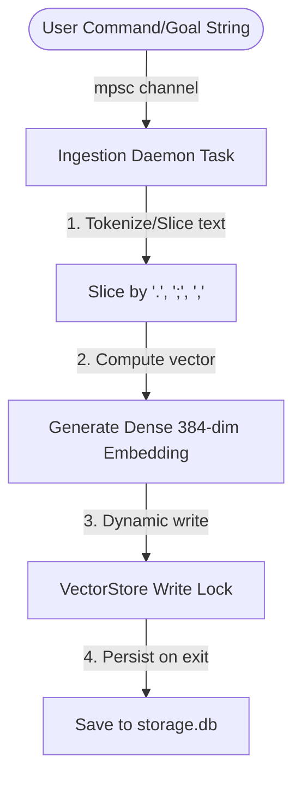

# Octos Vector Storage Persistence & Ingestion Model

This document specifies the persistence layout and dynamic context ingestion models used by the **Octos** User-Space Simulator to index and retrieve VFS state across sessions.

## 1. JSON Database Serialization Schema
Octos avoids bloated hierarchical storage in favor of a file-backed JSON vector database.
- **Serialization Engine**: Serde JSON (`serde_json` crate), wrapping standard `serde` derive hooks.
- **Path Location**: `C:\octos\octos\storage.db`
- **Boot Lifecycle**:
  ```text
  [System Boot]
        │
        ├──► check path exists?
        │      ├──► No: Initialize empty VectorStore
        │      │        populate default 384-dimensional system node arrays
        │      │        write to disk (bootstrap initial JSON)
        │      │
        │      └──► Yes: Load bytes from file
        │                deserialize JSON into VectorStore struct
        │                run 384-dimensional validation query matching history
  ```

---

## 2. Automated Context Ingestion Daemon
The **Ingestion Daemon** is an asynchronous background worker launched alongside the core router bus.



### Text Chunking
Long inputs are dynamically sliced by punctuation boundary delimiters (e.g. `.` `,` `;`) into individual semantic context chunks to isolate search scopes.

### Dense 384-Dimensional Embedding Generation
For each text chunk, Octos calculates a normalized unit-length 384-dimensional vector using:
1. **Character Distribution**: Distributes character codes across the 384 dimensions modulo indices.
2. **Frequency Density Modifier**: Adds a deterministic sine-based frequency modifier to build a dense vector structure.
3. **Unit Normalization**: Normalizes the vector to unit length so that Cosine Similarity ranks semantic matches consistently:
   $$\|\mathbf{v}\| = \sqrt{\sum_{i=1}^{384} v_i^2}$$
   $$v_i \leftarrow \frac{v_i}{\|\mathbf{v}\|}$$

### Strict Bounds Verification
To prevent kernel panics, the `VectorStore::search` interface verifies that the query vector has exactly 384 dimensions. Bounds failures log a warning and return empty results safely.

---

## 3. Concurrency & Thread Safety
Since the Vector DB is modified dynamically by user history ingestion and queried concurrently by active simulator task arms, thread boundaries are protected using:
- **Arc sharing**: `Arc<RwLock<VectorStore>>` allowing multiple reader tasks or a single writer.
- **Tokio channel boundaries**: The Ingestion Daemon consumes messages via an `mpsc` queue, isolating file persistence operations from the high-priority packet-routing loop.
