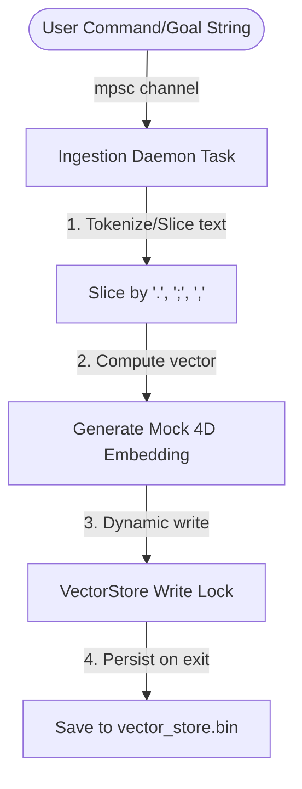

# Octos Vector Storage Persistence & Ingestion Model

This document specifies the persistence layout and dynamic context ingestion models used by the **Octos** User-Space Simulator to index and retrieve VFS state across sessions.

## 1. Binary Serialization Schema
Octos avoids bloated hierarchical storage in favor of a file-backed binary vector database.
- **Serialization Engine**: Bincode (`bincode` crate), wrapping standard `serde` derive hooks.
- **Path Location**: `C:\octos\octos\vector_store.bin`
- **Boot Lifecycle**:
  ```text
  [System Boot]
        │
        ├──► check path exists?
        │      ├──► No: Initialize empty VectorStore
        │      │        populate default system node arrays
        │      │        write to disk (bootstrap)
        │      │
        │      └──► Yes: Load bytes from file
        │                deserialize into VectorStore struct
        │                run verification query matching history
  ```

---

## 2. Automated Context Ingestion Daemon
The **Ingestion Daemon** is an asynchronous background worker launched alongside the core router bus.



### Text Chunking
Long inputs are dynamically sliced by punctuation boundary delimiters (e.g. `.` `,` `;`) into individual semantic context chunks to isolate search scopes.

### Mock Sparse Embedding Generation
For each text chunk, Octos calculates a normalized unit-length 4D vector using relative frequencies:
- **Dimension 0**: Normalized Vowel count ($N_{vowels} / N_{chars}$).
- **Dimension 1**: Normalized Consonant count ($N_{consonants} / N_{chars}$).
- **Dimension 2**: Normalized Special Character/Whitespace count.
- **Dimension 3**: Seed value constant ($0.5$).

The vector is normalized to unit length so that Cosine Similarity ranks semantic matches consistently:
$$\|\mathbf{v}\| = \sqrt{v_0^2 + v_1^2 + v_2^2 + v_3^2}$$
$$v_i \leftarrow \frac{v_i}{\|\mathbf{v}\|}$$

---

## 3. Concurrency & Thread Safety
Since the Vector DB is modified dynamically by user history ingestion and queried concurrently by active simulator task arms, thread boundaries are protected using:
- **Arc sharing**: `Arc<RwLock<VectorStore>>` allowing multiple reader tasks or a single writer.
- **Tokio channel boundaries**: The Ingestion Daemon consumes messages via an `mpsc` queue, isolating file persistence operations from the high-priority packet-routing loop.
