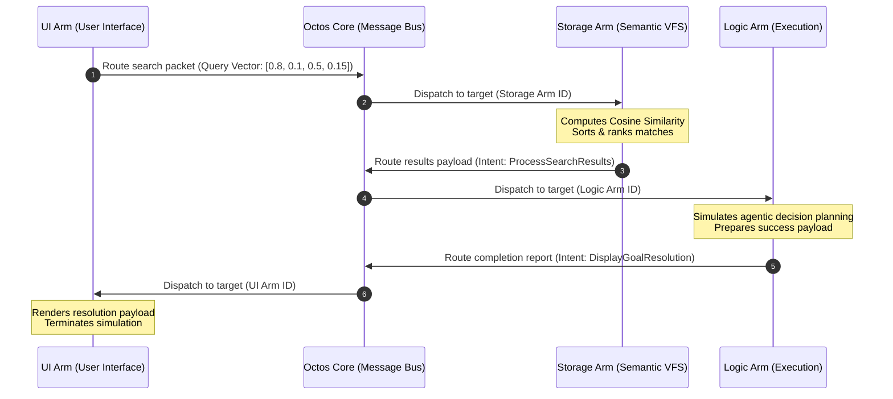

# Octos Simulator Daemon

Octos is a bare-metal, AI-first operating system framework. This repository contains the Phase 1 simulator: a user-space daemon that acts as an OS overlay layer to test core architectural primitives in Rust.

## Workspace Crates
- **`octos-core`** (Binary): The central daemon and asynchronous message routing orchestrator.
- **`octos-iac`** (Library): The Inter-Arm Communication protocol definitions and serialization structures.
- **`octos-storage`** (Library): The non-hierarchical vector filesystem simulator utilizing cosine similarity search.

## Running the Simulator

Ensure you have a recent version of the Rust toolchain installed. To build and run the simulation, execute:

```bash
cargo run
```

This will:
1. Spin up a multi-threaded Tokio runtime.
2. Initialize the `VectorStore` with mock knowledge nodes representing documentation, code, and user data.
3. Register mock Arms: Storage Arm, Logic Arm, and UI Arm.
4. Trigger a simulated user semantic query goal.
5. Asynchronously route IAC packets through the channel-based message bus.
6. Perform real-time cosine similarity search on the Vector File System.
7. Print detailed execution tracing.

## How the Simulator Works

The simulator models the core communication and retrieval primitives of the Octos operating system through an asynchronous message loop. Here is the step-by-step lifecycle of a simulation run:



### 1. Vector File System Setup
The simulator initializes `VectorStore` (an in-memory vector database) representing the non-hierarchical vector filesystem. It is populated with mock nodes containing documentation and configuration code, mapped to high-dimensional latent vectors (e.g., `[0.75, 0.15, 0.45, 0.10]`).

### 2. Core Registry & Bus Activation
- **Orchestrator Registry**: `OctosCore` registers the three simulated subsystem components (**Arms**), identifying each by a unique UUID and a list of capabilities (`UserInterface`, `SemanticStorage`, `CodeExecution`).
- **Tokio Channel Bus**: The Core starts a background router loop listening to a tokio Multi-Producer Single-Consumer (`mpsc`) channel. Any Arm can asynchronously push `IacPacket` messages onto this channel.

### 3. Execution Flow of a Goal
1. **Goal Broadcast**: A mock User Goal is generated (e.g., *"Analyze Octos memory capability systems..."*).
2. **Intent & Vector Injection**: The **UI Arm** forms a packet containing a mock 4D query vector (`[0.80, 0.10, 0.50, 0.15]`) representing the semantic intent of the query, and routes it to the **Storage Arm**.
3. **Similarity Search**: The **Storage Arm** processes the packet. It evaluates the query vector against all nodes in the vector store using **Cosine Similarity**:
   $$\text{Similarity} = \frac{\mathbf{A} \cdot \mathbf{B}}{\|\mathbf{A}\| \|\mathbf{B}\|}$$
   It retrieves the top scoring nodes, packs them into a JSON string, and sends a new `IacPacket` to the **Logic Arm**.
4. **Logic Planning**: The **Logic Arm** parses the JSON payload, simulates logic verification on the zero-copy memory capabilities, and issues a final resolution packet to the **UI Arm**.
5. **Goal Termination**: The **UI Arm** receives and prints the final success confirmation and signals the router loop to break, letting the system shutdown cleanly.

