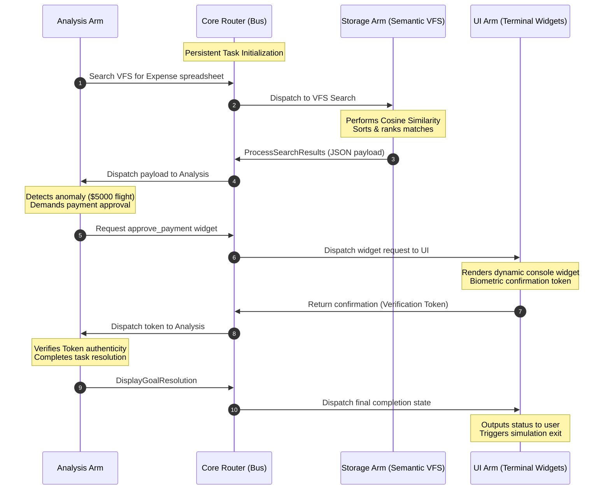

# Octos Simulator Daemon

Octos is a bare-metal, AI-first operating system framework. This repository contains the Phase 1 simulator: a user-space daemon that acts as an OS overlay layer to test core architectural primitives in Rust.

## Workspace Crates
- **`octos-core`** (Binary): The central daemon and asynchronous message routing orchestrator.
- **`octos-iac`** (Library): The Inter-Arm Communication protocol definitions and serialization structures.
- **`octos-storage`** (Library): The non-hierarchical vector filesystem simulator utilizing cosine similarity search.

## Running the Simulator

Ensure you have a recent version of the Rust toolchain installed. Navigate to the workspace root directory and execute using one of the following modes:

### 1. Automated Mode (Default)
Runs in automated mode simulating human operator confirmations:
```bash
cargo run --bin octos-core
```

### 2. Interactive Mode
Launches live prompt confirmations requesting stdin input from the terminal user (`y` or `yes` to approve, other key to decline):
```bash
cargo run --bin octos-core -- -i
# or
cargo run --bin octos-core -- --interactive
```

### Development Commands

* **Build debug workspace:**
  ```bash
  cargo build
  ```
* **Build release (optimized) workspace:**
  ```bash
  cargo build --release
  ```
* **Run syntax and type checking:**
  ```bash
  cargo check
  ```

This will:
1. Spin up a multi-threaded Tokio runtime.
2. Load the historical database from `vector_store.bin` (or bootstrap initial spreadsheet nodes if first run).
3. Conduct semantic validation checking that past inputs match.
4. Spawn the background Ingestion Daemon worker task.
5. Register persistent Arms (Storage, Analysis, UI).
6. Route the packet lifecycle, capturing operator goals and inputs to slice, embed, and append them dynamically.
7. Save DB updates back to disk before terminating.

## How the Simulator Works

The simulator models the core communication and retrieval primitives of the Octos operating system through persistent asynchronous tasks executing over a point-to-point virtual bus. Here is the step-by-step lifecycle of the expense spreadsheet audit simulation:



For a detailed review of the system topology and microkernel architecture design, refer to [ARCHITECTURE.md](file:///C:/octos/octos/ARCHITECTURE.md). For details on vector file serialization and async terminal background ingestion, refer to [PERSISTENCE.md](file:///C:/octos/octos/PERSISTENCE.md).

### 1. Vector File System Setup
The simulator initializes `VectorStore` (an in-memory vector database) representing the non-hierarchical vector filesystem. It is populated with mock nodes containing spreadsheet data and audit logs mapped to high-dimensional latent vectors (e.g., `[0.85, 0.15, 0.60, 0.10]`).

### 2. Core Registry & Bus Activation
- **Orchestrator Senders**: `OctosCore` registers the three simulated subsystem components (**Arms**), mapping each by a unique UUID and a list of capabilities to individual `tokio::mpsc` channels.
- **Router Bus**: The Core starts a background router loop (`start_router_loop`) listening to the main bus channel. It dynamically forwards incoming `IacPacket` messages to the target Arm channel by lookup.

### 3. Execution Flow of a Goal
1. **Goal Broadcast**: A mock User Goal is generated: *"Analyze my local expense spreadsheets from last month and flag anomalies."*
2. **Intent & Vector Injection**: The **Analysis Arm** forms a packet containing a mock 4D query vector (`[0.80, 0.10, 0.50, 0.10]`) representing the semantic intent of the query, and routes it to the **Storage Arm**.
3. **Similarity Search**: The **Storage Arm** processes the packet. It evaluates the query vector against all nodes in the vector store using **Cosine Similarity**:
   $$\text{Similarity} = \frac{\mathbf{A} \cdot \mathbf{B}}{\|\mathbf{A}\| \|\mathbf{B}\|}$$
   It retrieves the top scoring spreadsheet node, packs it into a JSON string, and sends a new `IacPacket` to the **Analysis Arm**.
4. **Logic Planning & Anomaly Detection**: The **Analysis Arm** parses the JSON payload, discovers a $5000 wire transfer anomaly, and issues an `approve_payment` intent packet directed to the **UI Arm**.
5. **UI Widget Trigger**: The **UI Arm** intercepts the packet, renders the dynamic console widget frame, simulates human biometric confirmation, and returns a verified confirmation token.
6. **Goal Termination**: The **Analysis Arm** validates the token, completes the audit, and sends a final completion packet to the **UI Arm**, which prints the status and triggers a graceful shutdown.


